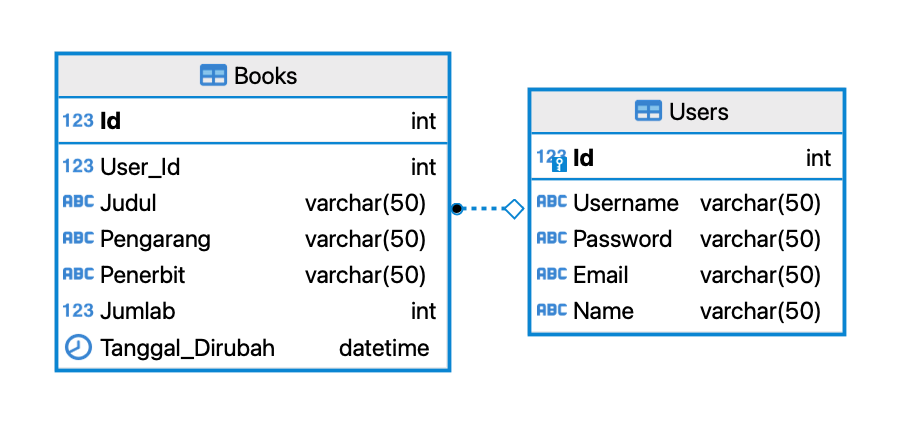

# SOAL IT FEST 2021 - Divisi Aplikasi

|Catatan khusus:|
|--|
|<ol><li>Gunakan format berikut untuk nama proyek Anda: IT-FEST2021_[KELAS]_[NAMA], contoh: IT-FEST2021_XIISIJAB_MARTIN.</li> <li>Anda harus menyerahkan seluruh proyek dan memastikan bahwa proyek dapat dijalankan di komputer lain (PC) tanpa konfigurasi tambahan. Harap perhatikan string koneksi database Anda! </li> <li> Jika Anda gagal mengirimkan proyek yang tepat yang menyebabkan proyek tidak dapat dikompilasi, tidak ada skor akan diberikan. </li> <li> Anda tidak diperbolehkan untuk memodifikasi atau mengubah struktur database yang diberikan. Namun, Anda dapat memasukkan catatan tambahan. </li> </ol>|

|Prosedur Pengumpulan|
|--|
|<ol><li>Ada dua hal yang harus di kumpulkan</li> <li>Yang pertama adalah database export masing masing dalam bentuk sql, untuk mengenerate database sql ikuti langkah langkah [berikut](https://ourcodeworld.com/articles/read/846/how-to-export-a-ms-sql-server-database-to-a-sql-script-database-to-sql-file-with-microsoft-sql-server-management-studio-17). **Pastikan pada bagian _Set Scripting Actions_, opsi Types of data to script sudah diubah menjadi Schema and data**. <li>Yang kedua adalah folder project Visual Studionya.</li><li>Kemudian archive keduanya dengan nama IT-FEST2021_[KELAS]_[NAMA].zip</li><li>Kumpulkan file tersebut melalui [form ini](https://forms.gle/TYw4PEbybQwykAHu9).</li></ol>|

<h1 align="center">STEMSEND Books</h1>

STEMSEND Books adalah aplikasi baru yang bertujuan untuk membantu mengelola sistem penyimpanan buku di SMK Negeri 2 Klaten. Sebagai developer yang baru diangkat, Anda ditugaskan untuk membuat Aplikasi Desktop. Diberikan di sepanjang proyek adalah ERD, sample data, dan detail dari setiap fitur yang diminta.

## A. Database
Nama Database : STEMSEND_BooksDB
### ERD

### Detail
| Table | Key | Column          | Data Type   | Nullable | Default Value     | Notes                                              |
|-------|-----|-----------------|-------------|----------|-------------------|----------------------------------------------------|
| Users | PK  | Id              | INT         | No       | -                 | Auto Increment                                     |
|       |     | Username        | VARCHAR(50) | No       | -                 |                                                    |
|       |     | Password        | VARCHAR(50) | No       | -                 |                                                    |
|       |     | Email           | VARCHAR(50) | No       | -                 | Unique Value                                       |
|       |     | Nama            | VARCHAR(50) | No       | -                 |                                                    |
| Books | PK  | Id              | INT         | No       | -                 |                                                    |
|       | FK  | User_Id         | INT         | No       | -                 |                                                    |
|       |     | Judul           | VARCHAR(50) | No       | -                 | Unique Value                                       |
|       |     | Pengarang       | VARCHAR(50) | No       | -                 |                                                    |
|       |     | Penerbit        | VARCHAR(50) | No       | -                 |                                                    |
|       |     | Jumlah          | INT         | No       | 1                 |                                                    |
|       |     | Tanggal_Dirubah | DATETIME    | No       | CURRENT_TIMESTAMP | Waktu data dibuat atau waktu terakhir data diubah. |

## B. Login
- [x] Form login digunakan oleh staf untuk mengakses menu di dalam sistem. 
- [x] Memvalidasi bahwa informasi login ada di database. 
- [x] Tampilkan pesan kesalahan yang tepat jika perlu.
- [x] Jika login sukses, langsung diarahkan ke Home.

## C. Home
- [x] Semua data Buku harus tampil dengan kolom Nama Buku, Pengarang, Penerbit dan Jumlah.
- [x] Ketika user mengetikan kata di TextBox Cari, maka filter data yang ditampilkan di datagrid berdasarkan nama buku atau pengarang atau penerbit atau jumlah yang seperti kata yang di cari.
- [x] Jika tombol Tambah Buku ditekan, akan memunculkan Form Tambah Buku.
- [x] Jika tombol Edit Buku ditekan, akan memunculkan Form Edit Buku.
- [x] Jika tombol Hapus Buku ditekan, akan memunculkan Form Hapus Buku.
- [x] Jika tombol Logout ditekan, maka user akan keluar dari aplikasi dan kembali ke Form Login.
- [x] Tampilkan pesan konfirmasi yang tepat jika perlu.
- [x] Tampilkan pesan kesalahan yang tepat jika perlu.

## D. Tambah Buku
- [x] Form Tambah Buku digunakan untuk menambahkan data buku baru.
- [x] Pada saat tombol Simpan ditekan, simpan data yang telah dimasukan user.
- [x] Pada saat akan menyimpan data, gunakan validasi data yang tepat.
- [x] Jika tombol Batal ditekan, tutup Form Tambah Buku dan kembali ke Form Home.
- [x] Setelah data berhasil disimpan, tutup Form Tambah Buku dan kembali ke Form Home serta refresh data grid yang ada di Form Home.
- [x] Tampilkan pesan kesalahan yang tepat jika perlu.

## E. Edit Buku
- [x] Form Edit Buku digunakan untuk mengedit data buku yang sudah ada.
- [x] Pada saat pertama kali form muncul, semua Id buku ada di Combo Box Id buku.
- [x] Pada saat pertama kali form muncul, semua field selain Id buku secara otomatis terisi dengan data buku sesuai id buku yang terpilih pertama kali.
- [x] Pada saat id buku yang dipilih berubah, field lain juga ikut terisi secara otomatis dengan data buku sesuai id buku yang dipilih.
- [x] Pada saat tombol Simpan ditekan, update data yang telah dimasukan user.
- [x] Pada saat akan menyimpan data, gunakan validasi data yang tepat.
- [x] Jika tombol Batal ditekan, tutup Form Edit Buku dan kembali ke Form Home.
- [x] Setelah data berhasil disimpan, tutup Form Edit Buku dan kembali ke Form Home serta refresh data grid yang ada di Form Home.
- [x] Tampilkan pesan kesalahan yang tepat jika perlu.

## F. Hapus Buku
- [x] Form Hapus Buku digunakan untuk menghapus data buku yang sudah ada.
- [x] Pada saat pertama kali form muncul, semua Id buku ada di Combo Box Id buku.
- [x] Pada saat pertama kali form muncul, semua field selain Id buku secara otomatis terisi dengan data buku sesuai id buku yang terpilih pertama kali.
- [x] Pada saat id buku yang dipilih berubah, field lain juga ikut terisi secara otomatis dengan data buku sesuai id buku yang dipilih.
- [x] Pada saat tombol Hapus ditekan, hapus data buku sesuai buku yang dipilih.
- [x] Pada saat akan menghapus data, tampilkan pesan konfirmasi yang sesuai sebelum data benar benar terhapus.
- [x] Jika tombol Batal ditekan, tutup Form Hapus Buku dan kembali ke Form Home.
- [x] Setelah data berhasil dihapus, tutup Form Hapus Buku dan kembali ke Form Home serta refresh data grid yang ada di Form Home.
- [x] Tampilkan pesan kesalahan yang tepat jika perlu.

<h2 align="center">SELAMAT MENGERJAKAN</h2>